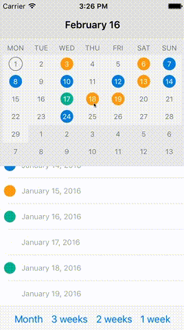

# MJCalendar

[](https://travis-ci.org/Michał Jackowski/MJCalendar)
[](http://cocoapods.org/pods/MJCalendar)
[](http://cocoapods.org/pods/MJCalendar)
[](http://cocoapods.org/pods/MJCalendar)

##Demo GIF##


## Usage

To run the example project, clone the repo, and run `pod install` from the Example directory first.

## Installation

MJCalendar is available through [CocoaPods](http://cocoapods.org). To install
it, simply add the following line to your Podfile:

```ruby
pod "MJCalendar"
```


## Customization ##

```
#!swift

// Set displayed period type. Available types: Month, ThreeWeeks, TwoWeeks, OneWeek
self.calendarView.configuration.periodType = .Month

// Set shape of day view. Available types: Circle, Square
self.calendarView.configuration.dayViewType = .Circle

// Set selected day display type. Available types: 
// Border - Only border is colored with selected day color
// Filled - Entire day view is filled with selected day color
self.calendarView.configuration.selectedDayType = .Border

// Set width of selected day border. Relevant only if selectedDayType = .Border
self.calendarView.configuration.selectedBorderWidth = 1

// Set day text color
self.calendarView.configuration.dayTextColor = UIColor(hexString: "6f787c")

// Set day background color
self.calendarView.configuration.dayBackgroundColor = UIColor(hexString: "f0f0f0")

// Set selected day text color
self.calendarView.configuration.selectedDayTextColor = UIColor.whiteColor()

// Set selected day background color
self.calendarView.configuration.selectedDayBackgroundColor = UIColor(hexString: "6f787c")

// Set other month day text color. Relevant only if periodType = .Month
self.calendarView.configuration.otherMonthTextColor = UIColor(hexString: "6f787c")

// Set other month background color. Relevant only if periodType = .Month
self.calendarView.configuration.otherMonthBackgroundColor = UIColor(hexString: "E7E7E7")

// Set week text color
self.calendarView.configuration.weekLabelTextColor = UIColor(hexString: "6f787c")

// Set start day. Available type: .Monday, Sunday
self.calendarView.configuration.startDayType = .Monday

// Set day text font
self.calendarView.configuration.dayTextFont = UIFont.systemFontOfSize(12)

//Set week's day name font
self.calendarView.configuration.weekLabelFont = UIFont.systemFontOfSize(12)

//Set day view size. It includes border width if selectedDayType = .Border
self.calendarView.configuration.dayViewSize = CGSizeMake(24, 24)

//Set height of row with week's days
self.calendarView.configuration.rowHeight = 30

// Set height of week's days names view
self.calendarView.configuration.weekLabelHeight = 25

// To commit all configuration changes execute reloadView method
self.calendarView.reloadView()

```

## Delegates

Apart from setting colors in calendar configuration, it might be set in delegates methods.
Returning nil means that the color from configuration will be displayed. 

```
#!swift

func calendar(calendarView: MJCalendarView, textColorForDate date: NSDate) -> UIColor? {
    return self.dayColors[date]?.textColor
}

func calendar(calendarView: MJCalendarView, backgroundForDate date: NSDate) -> UIColor? {
    return self.dayColors[date]?.backgroundColor
}

```

Once displayed period of time is changed either by left right swipe or by select date method, method didChangePeriod is triggered. Usage example.

```
#!swift

func calendar(calendarView: MJCalendarView, didChangePeriod periodDate: NSDate, bySwipe: Bool) {
    // Sets month name according to presented dates
    self.setTitleWithDate(periodDate)
    
    // bySwipe diffrentiate changes made from swipes or select date method
    if bySwipe {
        // Scroll to relevant date in tableview
        self.scrollTableViewToDate(periodDate)
    }
}

```

When user selects date by tapping on particular day, method didSelectDate is triggered. Usage example.

```
#!swift
func calendar(calendarView: MJCalendarView, didSelectDate date: NSDate) {
    self.scrollTableViewToDate(date)
}

```

## Public methods

To select date from code use method selectDate. Usage example.

```
#!swift
func scrollViewDidScroll(scrollView: UIScrollView) {
    // Prevent changing selected day when non user scroll is triggered.
    if !self.isScrollingAnimation {
        // Get all visible cells from tableview
        if let visibleCells = self.tableView.indexPathsForVisibleRows {
            if let cellIndexPath = visibleCells.first {
                // Get day by indexPath
                let day = self.dateByIndex(cellIndexPath.row)
                
                //Select day according to first visible cell in tableview
                self.calendarView.selectDate(day)
            }
        }
    }
}

```

To change displayed period on runtime use method animateToPeriod. 
Method params:

- periodType: available types: Month, ThreeWeeks, TwoWeeks, OneWeek. If type is same as one already displayed no animation is being performed.
- duration: duration of animation in seconds
- animation block: optional block to add custom animation while period is being animated
Usage example.


```
#!swift    
self.calendarView.animateToPeriodType(period, duration: 0.2, animations: { (calendarHeight) -> Void in
    // In animation block you can add your own animation. To adapat UI to new calendar height you can use calendarHeight param
    self.calendarViewHeight.constant = calendarHeight
    self.view.layoutIfNeeded()
}, completion: nil)


```

 

## Requirements

Xcode 7+, Swift 2.0+


## Author

Michał Jackowski, mk.jackowski@gmail.com

## License

MJCalendar is available under the MIT license. See the LICENSE file for more info.
