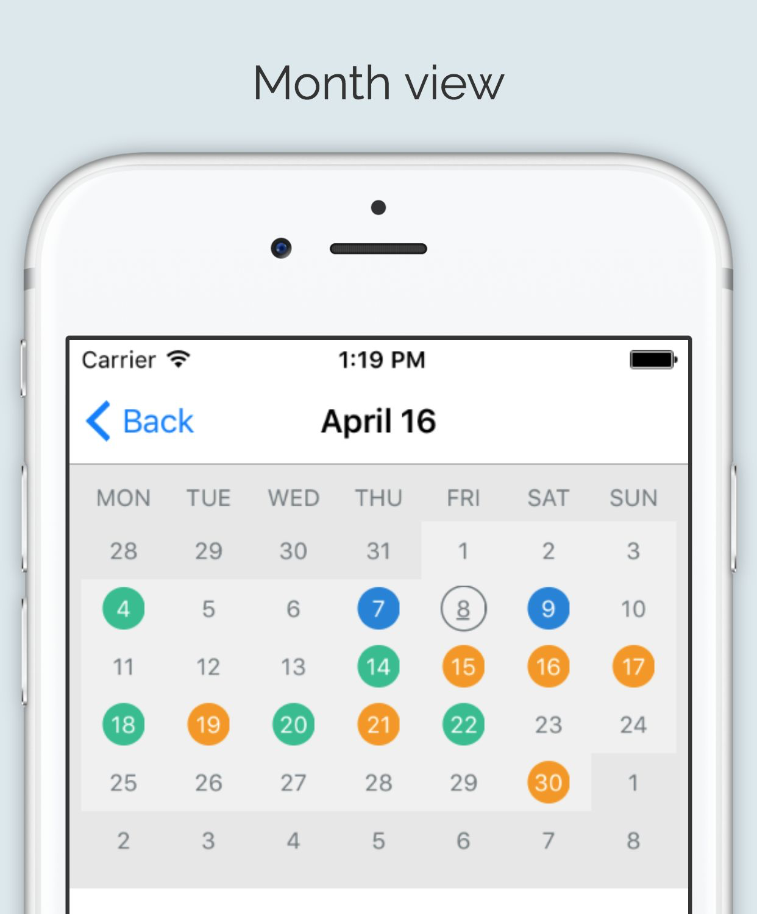
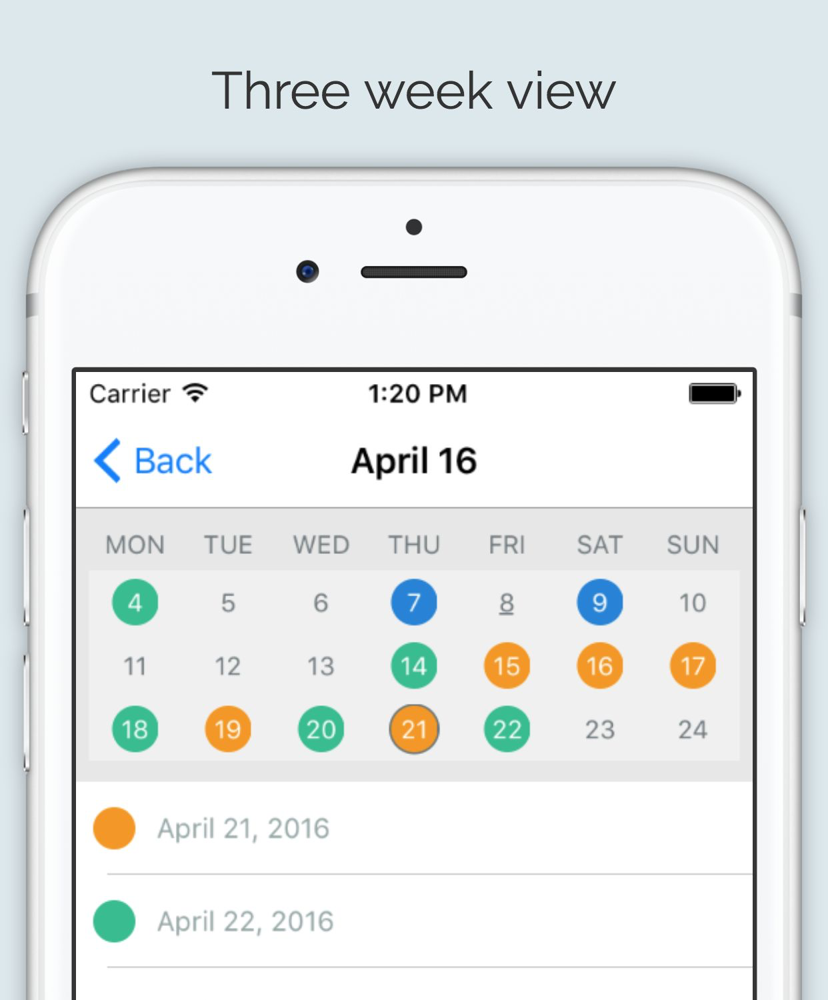
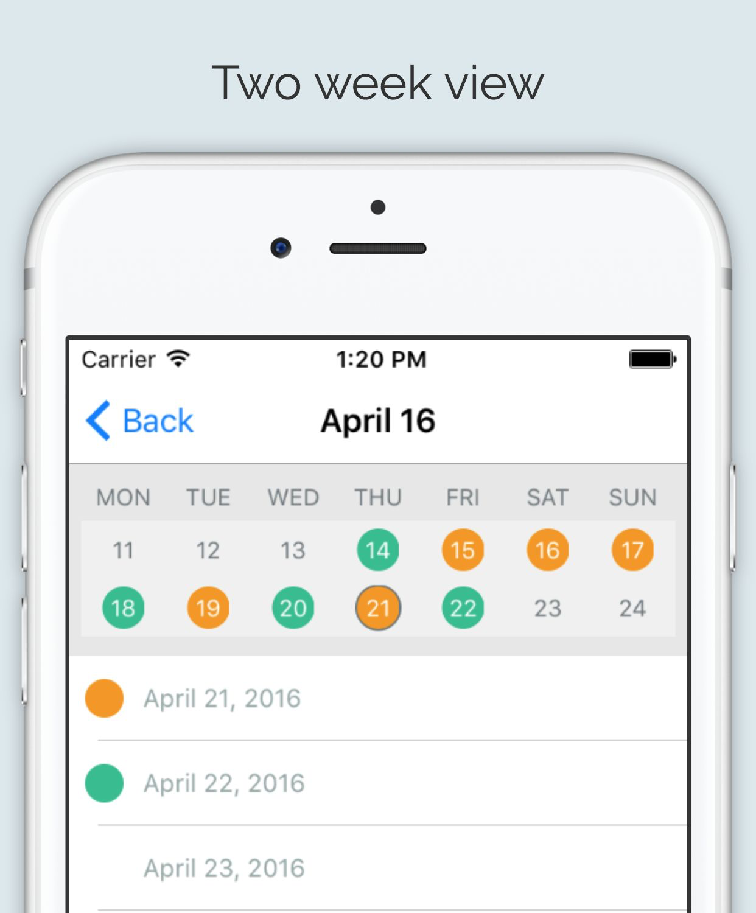
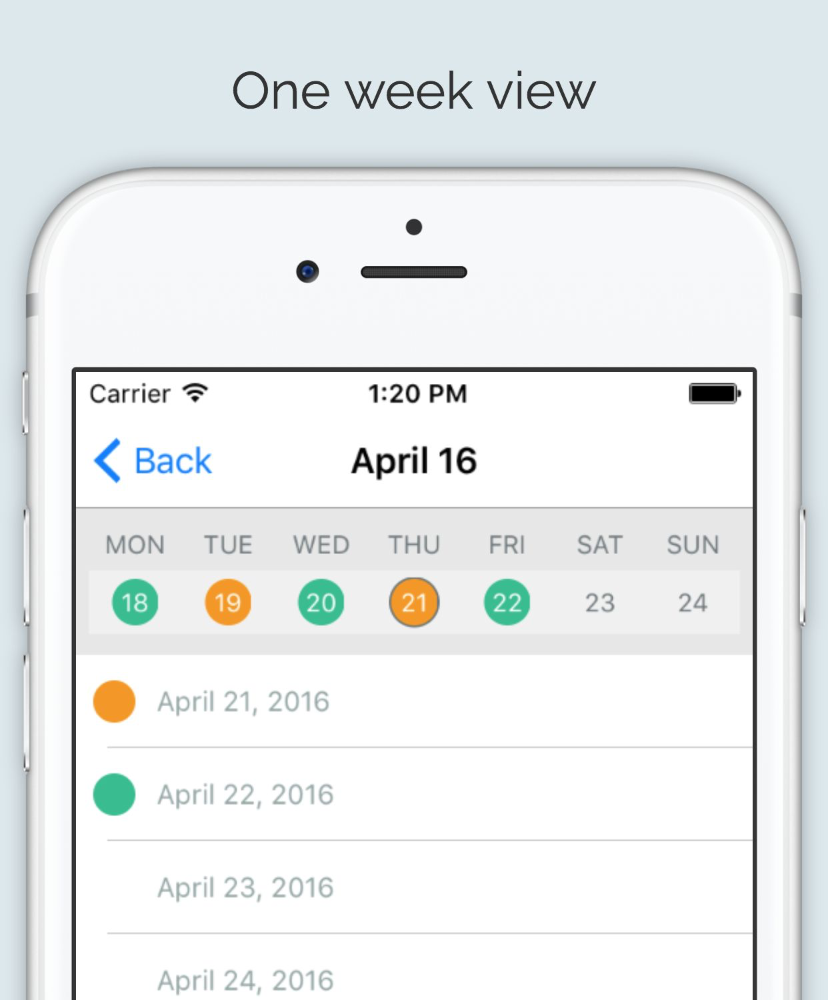
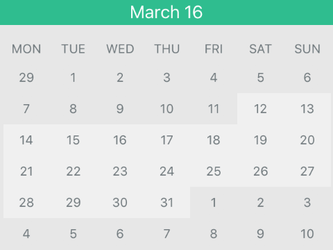
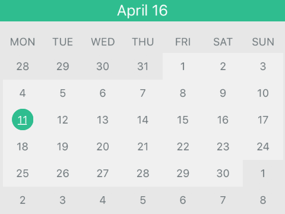
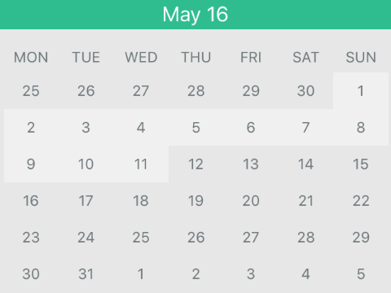
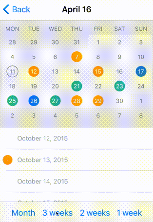

# MJCalendar

[](https://travis-ci.org/Michał Jackowski/MJCalendar)
[](http://cocoapods.org/pods/MJCalendar)
[](http://cocoapods.org/pods/MJCalendar)
[](http://cocoapods.org/pods/MJCalendar)

## Usage

To run the example project, clone the repo, and run `pod install` from the Example directory first.

## Installation

MJCalendar is available through [CocoaPods](http://cocoapods.org). To install
it, simply add the following line to your Podfile:

```ruby
pod "MJCalendar"
```

##Calendar View##





## Customization ##

`MJConfiguration` class is responsible for all customizable attributes. To commit all configuration changes use method `reloadView()`.

```swift
// Set displayed period type. Available types: Month, ThreeWeeks, TwoWeeks, OneWeek
self.calendarView.configuration.periodType = .Month

// Set shape of day view. Available types: Circle, Square
self.calendarView.configuration.dayViewType = .Circle

self.calendarView.reloadView()
```

## Configuration

| Key | Type  | Default value |
|:-------------------------------------------------:|:---------------------------:|:----------------------------:|
| periodType | enum [.Month, .ThreeWeeks, .TwoWeeks, .OneWeek] | .Month |
| dayViewType | enum [.Square, .Circle] | .Circle |
| startDayType | enum [.Monday, .Sunday] | .Monday |
| selectedDayType | enum [.Filled, .Border] | .Border |
| rowHeight | CGFloat | 30 |
| dayViewSize | CGSize | CGSizeMake(24,24) |
| dayTextFont | UIFont | UIFont.systemFontOfSize(12) |
| otherMonthBackgroundColor | UIColor | UIColor.clearColor() |
| otherMonthDayViewBackgroundColor | UIColor | UIColor.clearColor() |
| otherMonthTextColor | UIColor | UIColor.clearColor() |
| dayBackgroundColor | UIColor | UIColor.clearColor() |
| dayDayViewBackgroundColor | UIColor | UIColor.clearColor() |
| dayTextColor | UIColor | UIColor.clearColor() |
| selectedDayBackgroundColor | UIColor | UIColor.clearColor() |
| selectedDayTextColor | UIColor | UIColor.clearColor() |
| selectedBorderWidth | CGFloat | 1 |
| weekLabelFont | UIFont | UIFont.systemFontOfSize(12) |
| weekLabelTextColor | UIColor | UIColor.clearColor() |
| weekLabelHeight | CGFloat | 25 |
| minDate | NSDate? | nil |
| maxDate | NSDate? | nil |
| outOfRangeDayBackgroundColor | UIColor | UIColor.clearColor() |
| outOfRangeDayTextColor | UIColor | UIColor.clearColor() |
| selectDayOnPeriodChange | Bool | true |


## Delegates

Apart from setting colors in calendar configuration, it might be set in delegates methods.
Returning nil means that the color from configuration will be displayed. 


```swift
func calendar(calendarView: MJCalendarView, textColorForDate date: NSDate) -> UIColor? {
    return self.dayColors[date]?.textColor
}

func calendar(calendarView: MJCalendarView, backgroundForDate date: NSDate) -> UIColor? {
    return self.dayColors[date]?.backgroundColor
}
```

Once displayed period of time is changed either by left right swipe or by select date method, method didChangePeriod is triggered. Usage example.


```swift
func calendar(calendarView: MJCalendarView, didChangePeriod periodDate: NSDate, bySwipe: Bool) {
    // Sets month name according to presented dates
    self.setTitleWithDate(periodDate)
    
    // bySwipe diffrentiate changes made from swipes or select date method
    if bySwipe {
        // Scroll to relevant date in tableview
        self.scrollTableViewToDate(periodDate)
    }
}
```

When user selects date by tapping on particular day, method didSelectDate is triggered. Usage example.


```swift
func calendar(calendarView: MJCalendarView, didSelectDate date: NSDate) {
    self.scrollTableViewToDate(date)
}

```

## Date Range
Variables `minDate` and `maxDate` from `MJConfiguration` are responsible for setting range of available dates. To define UI use properties: `outOfRangeDayBackgroundColor`, `outOfRangeDayTextColor`.





## Public methods

To select date from code use method `selectDate`. Usage example.


```swift
func scrollViewDidScroll(scrollView: UIScrollView) {
    // Prevent changing selected day when non user scroll is triggered.
    if !self.isScrollingAnimation {
        // Get all visible cells from tableview
        if let visibleCells = self.tableView.indexPathsForVisibleRows {
            if let cellIndexPath = visibleCells.first {
                // Get day by indexPath
                let day = self.dateByIndex(cellIndexPath.row)
                
                //Select day according to first visible cell in tableview
                self.calendarView.selectDate(day)
            }
        }
    }
}
```

## Period change animations

To change displayed period on runtime use method animateToPeriod. 
Method params:

- periodType: available types: `Month`, `ThreeWeeks`, `TwoWeeks`, `OneWeek`. If type is same as one already displayed no animation is being performed.
- duration: duration of animation in seconds
- animation block: optional block to add custom animation while period is being animated
Usage example.

```swift    
self.calendarView.animateToPeriodType(period, duration: 0.2, animations: { (calendarHeight) -> Void in
    // In animation block you can add your own animation. To adapat UI to new calendar height you can use calendarHeight param
    self.calendarViewHeight.constant = calendarHeight
    self.view.layoutIfNeeded()
}, completion: nil)
```


## Requirements

Xcode 7+, Swift 2.0+


## Author

Michał Jackowski, mk.jackowski@gmail.com

## License

MJCalendar is available under the MIT license. See the LICENSE file for more info.
